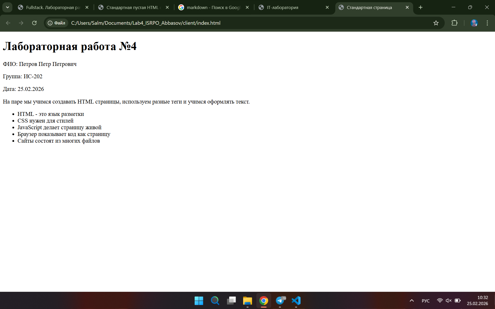

# 1. Заголовки всех уровней H1–H6
# H1
## H2
### H3
#### H4
##### H
###### H6
# 2. Горизонтальные линии
---
# 3. Форматирование текста
*КУРСИВ*
**ЖИРНЫЙ**
~~зачеркнутый~~
`моноширный`
# 4. Списки
- маркированный
1. нумерованный
    - вложенный
# 5. Цитаты
> цитата
# 6. Блоки кода
`Hello world(print)`
# 7. Таблица (минимум 3 столбца)
|таблица|на|3|
|-|-|-|
|столбца|||
# 8. Картинка из папки repo/

# 9. Ссылки
[ww](../client/cc.png)
[gogole](www.google.com)
# 10. Чекбоксы 
- [ ] не сделано
- [x] сделано
# 11. Alert-блоки GitHub
> [!NOTE]
> Пример
# 12. Inline LaTeX
$a^2 + b^2 = c^2$
# 13. Block LaTeX
$$
\sum_{i=1}^n i = \frac{n(n+1)}{2}
$$